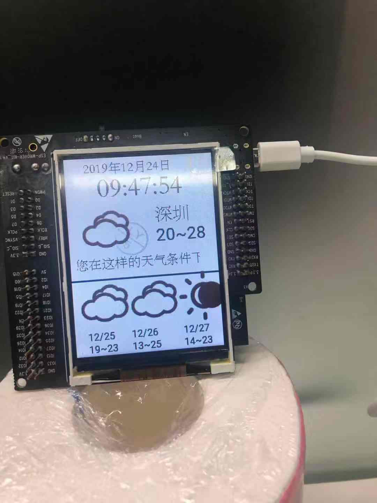
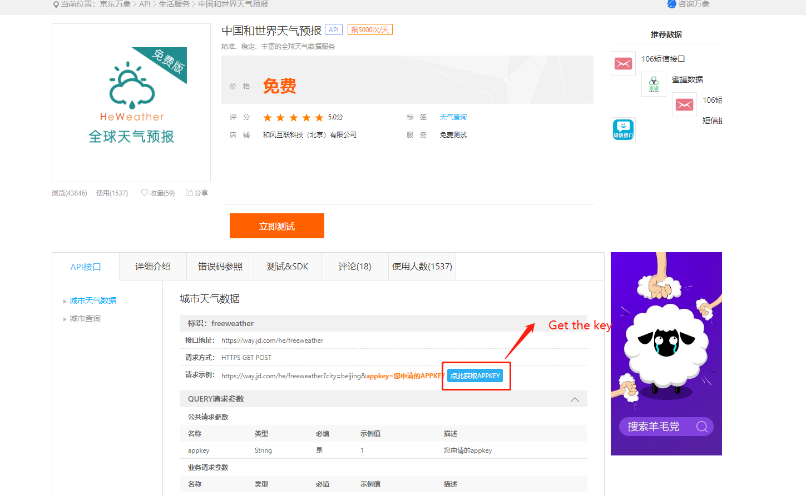
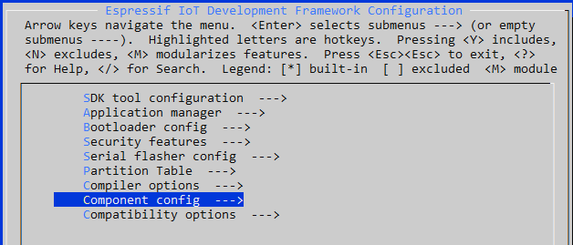
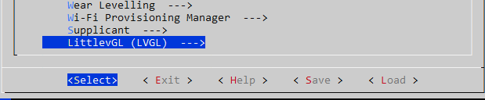
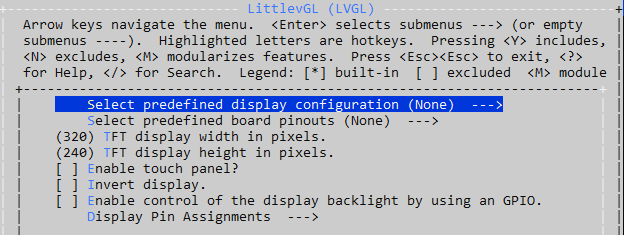
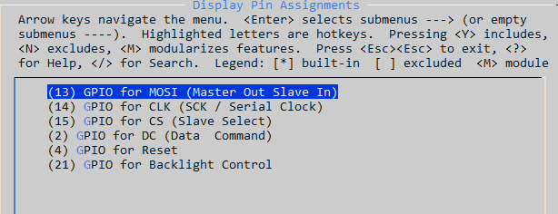
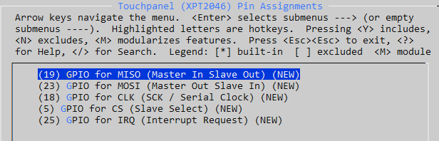
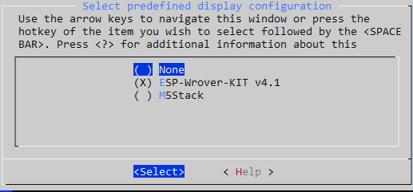
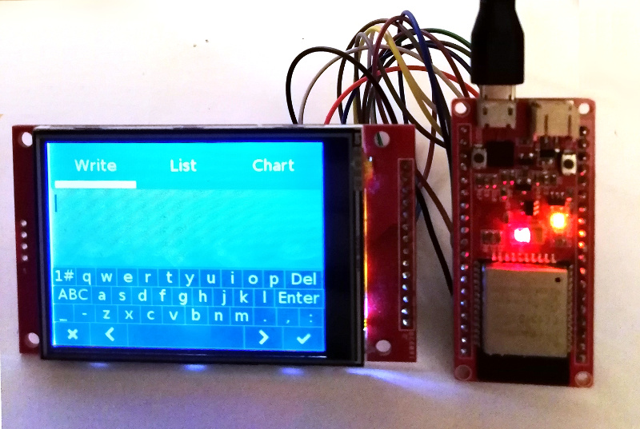

# Weather Station for ESP32



### Function:

1. Drive ili9341

2. Get weather data from [jingdong](https://way.jd.com/he/freeweather)


## Get started 

### Get the key

1.register the account from [jingdong](https://wx.jdcloud.com/market/datas/26/10610)


2.Get the key from the website



### Install the ESP32 SDK
http://esp-idf.readthedocs.io/en/latest/

Note:

This project is compatible with both the ESP-IDF 3.X branch and the 4.0 branch. For the 4.0 branch, you can use either make or CMake, but CMake is recommended. Instructions here are given for the latest toolchain using `idf.py` (which invokes CMake), but it is easy to translate to make. For example instead of running `idf.py menuconfig`, just run `make menuconfig`.

### Build this repository standalone and run the demo.

Try this first to make sure your hardware is supported, wired and configured properly.

1. Get this project: `git clone --recurse-submodules
https://github.com/donny681/ESP32_Weather_station.git`

2. From its root run `idf.py menuconfig`

3. Select your display kit or board and other options - see [config options](#configuration-options)

4. fill the key to the main/my_https.c,you can see the define `KEY`

5. `idf.py build`

6. `idf.py -p (YOUR PORT) flash` (with make this is just `make flash` - in 3.x PORT is configured in `menuconfig`)

### Install this project as a library submodule in your own project

It is recommended to install this repo as a submodule in your IDF project's git repo. The configuration system has been designed so that you do not need to copy or edit any files in this repo. By keeping your submodule directory clean you can ensure reproducible builds and easy updates from this upstream repository.


#### CMake

The examples below are taken from the ESP-IDF [blink](https://github.com/espressif/esp-idf/tree/master/examples/get-started/blink) example which you can copy and use as the basis for your own project.
The project root CMakeLists.txt file needs one line added, just before the project to add the extra components directory to the path like this:

```cmake
#CMakeLists.txt
cmake_minimum_required(VERSION 3.5)

include($ENV{IDF_PATH}/tools/cmake/project.cmake)

set(EXTRA_COMPONENT_DIRS externals/lv_port_esp32_ili9341/components)

project(blink)
```

In the CMakeLists.txt file for your `/main` or for the component(s) using LVGL you need to add REQUIRES directives for this project's driver and lvgl itself to the `idf_component_register` function e.g.

```cmake
#main/CMakeLists.txt
idf_component_register(
    SRCS "blink.c"
    INCLUDE_DIRS "."
    REQUIRES lvgl_ili9341 lvgl
)
```

#### Makefile
If you are using make, you only need to add the EXTRA_COMPONENT_DIRS in the root Makefile of your project:
```Makefile
PROJECT_NAME := blink
EXTRA_COMPONENT_DIRS := externals/lv_port_esp32_ili9341/components

include $(IDF_PATH)/make/project.mk
```

## Configuration options
There are a number of configuration options available, all accessed through `idf.py menuconfig` -> Components -> LittlevGL (LVGL).





Options include:
 * Display resolution - set the height and width of the display
 * Touch controller present
 * Invert display - if text and objects are backwards, you can enable this
 * Enable backlight control via GPIO (vs hardwiring on)
 * Backlight active high or low - some displays expect a high (1) signal to enable backlight, others expect (low) (default) - if your backlight doesn't come on try switching this

### Assign the correct pinout depending on your ESP32 dev board
There are several development boards based on the ESP32 chip, make sure you assign the correct pin numbers to the signals that interface with the TFT display board. Its recommended to use a predefined configuration below, but you can also set individual pins for both display controller and touch controller.




### Predefined Display Configurations



For development kits that come with a display already attached, all the correct settings are already known and can be selected in `menuconfig` from the first option "Select predefined display configuration." Once selected all the other options will be defaulted and won't appear in the menu.

Boards we currently have defined this way are:


## ESP32 Dev Board with 38 GPIOs



### ILI9341 - HSPI
<table>
  <tr>
    <th>MOSI</th>
    <th>CLK</th>
    <th>CS</th>
    <th>DC</th>
    <th>RST</th>
    <th>BCKL</th>
  </tr>
  <tr>
    <td>13</td>
    <td>14</td>
    <td>5</td>
    <td>19</td>
    <td>18</td>
    <td>23</td>
  </tr>
</table>

### XPT2046 - VSPI

<table>
  <tr>
    <th>MOSI</th>
    <th>MISO</th>
    <th>CLK</th>
    <th>CS</th>
    <th>IRQ</th>
  </tr>
  <tr>
    <td>32</td>
    <td>35</td>
    <td>26</td>
    <td>33</td>
    <td>25</td>
  </tr>
</table>

## ESP32 DevKit v1 with 30 GPIOS

There is another development kit with only 30 GPIOs available:


### ILI9341

For ILI9341 HSPI is used, modify the pin configuration in `components/drv/disp_spi.h` to:

### ILI9341 - HSPI
<table>
  <tr>
    <th>MOSI</th>
    <th>CLK</th>
    <th>CS</th>
    <th>DC</th>
    <th>RST</th>
    <th>BCKL</th>
  </tr>
  <tr>
    <td>13</td>
    <td>14</td>
    <td>15</td>
    <td>2</td>
    <td>4</td>
    <td>21</td>
  </tr>
</table>

### XPT2046 - VSPI

<table>
  <tr>
    <th>MOSI</th>
    <th>MISO</th>
    <th>CLK</th>
    <th>CS</th>
    <th>IRQ</th>
  </tr>
  <tr>
    <td>23</td>
    <td>19</td>
    <td>18</td>
    <td>5</td>
    <td>25</td>
  </tr>
</table>

## ESP32 DevKit v4 with 38 GPIOS

See this pdf for further information: https://www.espressif.com/sites/default/files/documentation/esp32-wroom-32d_esp32-wroom-32u_datasheet_en.pdf

### ILI9341 - HSPI
<table>
<tr>
<th>MOSI</th>
<th>CLK</th>
<th>CS</th>
<th>DC</th>
<th>RST</th>
<th>BCKL</th>
</tr>
<tr>
<td>13</td>
<td>14</td>
<td>15</td>
<td>17</td>
<td>25</td>
<td>26</td>
</tr>
</table>

### XPT2046 - VSPI

<table>
<tr>
<th>MOSI</th>
<th>MISO</th>
<th>CLK</th>
<th>CS</th>
<th>IRQ</th>
</tr>
<tr>
<td>23</td>
<td>19</td>
<td>18</td>
<td>5</td>
<td>27</td>
</tr>
</table>

## Other Boards

Of course, all the individual pins can be configured in `menuconfig` if the available prefines don't match your board or project requirements. By default the prefined options are disabled and pin settings for the 30 pin dev board are defaulted.


## generate the spiffs bin

1. download the  [spiffs tool](https://github.com/igrr/mkspiffs.git)

2. compile and generate the bin,please check the spiffs  intdouction(https://github.com/igrr/mkspiffs) 

3. download the output bin to the flash address 0x310000


Or you can flash the 'spiffs1.img'

python esp-idf/components/esptool_py/esptool/esptool.py --chip esp32 --port /dev/ttyUSB1 --baud 2000000  write_flash  0x1000 spiffs1.img

